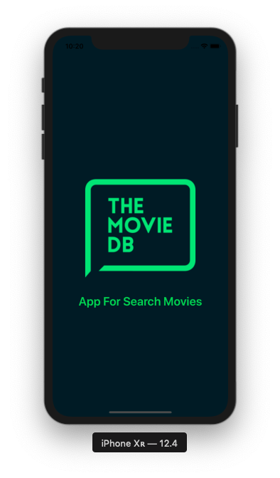
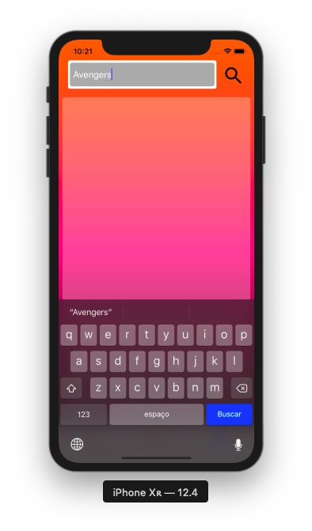
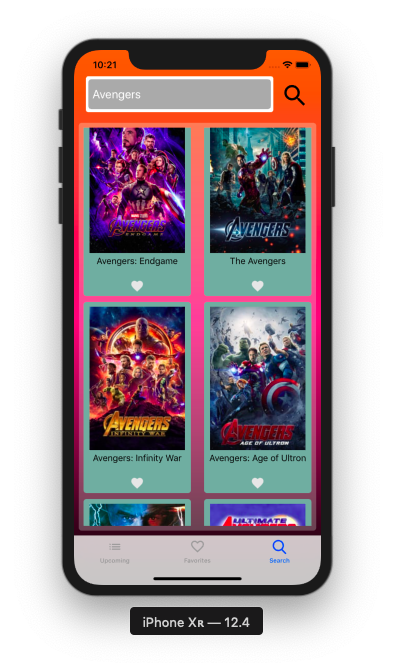
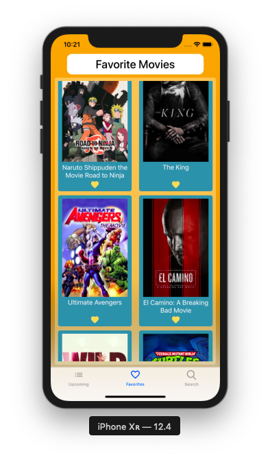
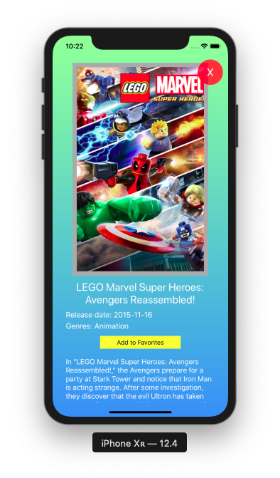

# Kobe Code Challenge

---

## The Movie Database App

---

Aplicativo para busca de filmes atraves da API do TMDb.

## Como funciona o app?

---

Este aplicativo permite visualizar os próximos filmes a serem lançados, e também realizar buscar por filmes através da API.
Caso o usuário goste, é possivel favoritar o filme. S2

### Fluxo do App

### Bibliotecas Utilizadas:

- CocoaPods, para o gerenciamento de dependencias;
- Alamofire e AlamofireImage, para o consumo da Api e download de imagens;
- SQLite, para persistencia de dados.

---

